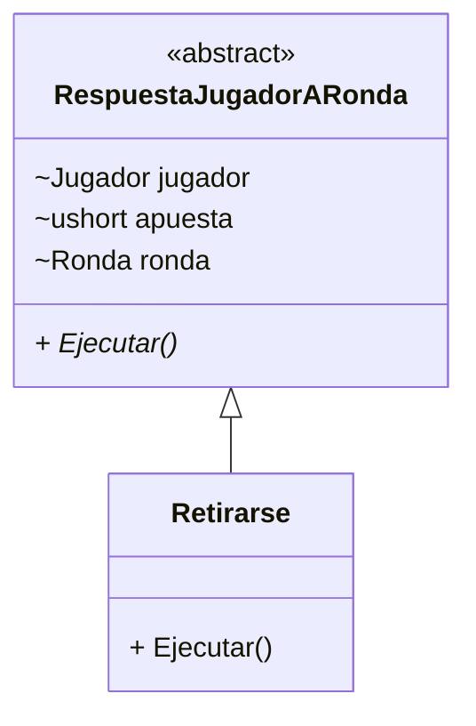

## Poker12.Core.LogicaRonda

### Diagrama de clases

```mermaid
classDiagram
    class RespuestaJugadorARonda{
        <<abstract>>
        ~Jugador jugador
        ~ushort apuesta
        ~Ronda ronda
        + Ejecutar()*
    }
    class Retirarse{
        + Ejecutar()
    }
    RespuestaJugadorARonda <|-- Retirarse
```

//ApostarTodo - MantenerApuesta - SubirApuesta //