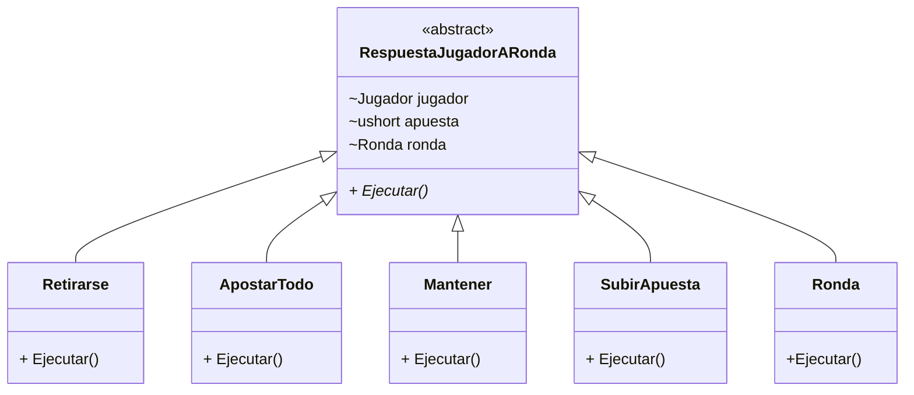
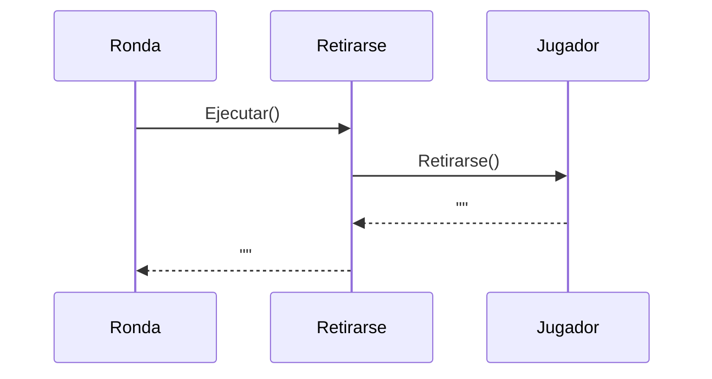
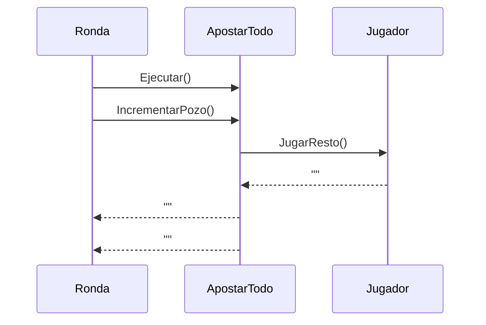
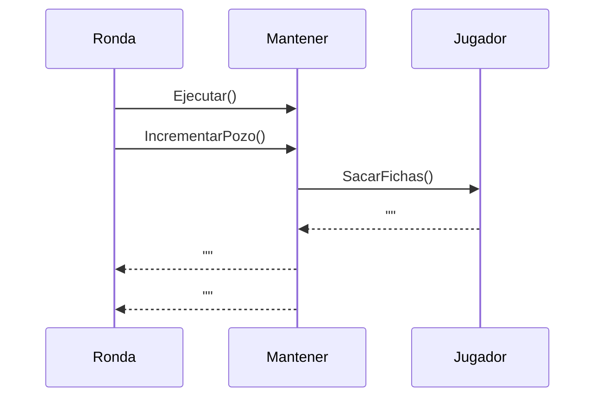

## Poker12.Core.LogicaRonda

### Diagrama de clases

```mermaid
classDiagram
    class RespuestaJugadorARonda{
        <<abstract>>
        ~Jugador jugador
        ~ushort apuesta
        ~Ronda ronda
        + Ejecutar()*
    }
    class Retirarse{
        + Ejecutar()
    }
    RespuestaJugadorARonda <|-- Retirarse

    class ApostarTodo{
        + Ejecutar()
    }

    class Mantener{
        + Ejecutar()
    }

    class SubirApuesta{
        + Ejecutar()
    }

    class Ronda{
        +Ejecutar()
    }
    RespuestaJugadorARonda <|-- ApostarTodo
    RespuestaJugadorARonda <|-- Mantener
    RespuestaJugadorARonda <|-- SubirApuesta
    RespuestaJugadorARonda <|-- Ronda
```

#### Secuencia para Retirarse

```mermaid
sequenceDiagram
    participant Ronda
    participant Retirarse
    participant Jugador

    Ronda ->> Retirarse: Ejecutar()
    Retirarse ->> Jugador: Retirarse()
    Jugador -->> Retirarse: ""
    Retirarse -->> Ronda: ""
```

#### Secuencia para Apostar Todo

```mermaid
sequenceDiagram
    participant Ronda
    participant ApostarTodo
    participant Jugador
    
    Ronda ->> ApostarTodo: Ejecutar()
    Ronda ->> ApostarTodo: IncrementarPozo()
    ApostarTodo ->> Jugador: JugarResto()
    Jugador -->> ApostarTodo: ""
    ApostarTodo -->> Ronda: ""
    ApostarTodo -->> Ronda: ""
```

#### Secuencia para Mantener

```mermaid
sequenceDiagram
    participant Ronda
    participant Mantener
    participant Jugador

    Ronda ->> Mantener: Ejecutar()
    Ronda ->> Mantener: IncrementarPozo()
    Mantener ->> Jugador: SacarFichas()
    Jugador -->> Mantener: ""
    Mantener -->> Ronda: ""
    Mantener -->> Ronda: ""
```
#### Secuencia para Subir Apuesta

```mermaid
sequenceDiagram
    participant Ronda
    participant SubirApuesta
    participant Jugador

    Ronda ->> SubirApuesta: Ejecutar()
    Ronda ->> SubirApuesta: IncrementarPozo()
    SubirApuesta ->> Jugador: SacarFichas()
    Jugador -->> SubirApuesta: ""
    SubirApuesta -->> Ronda: ""
    SubirApuesta -->> Ronda: ""
```