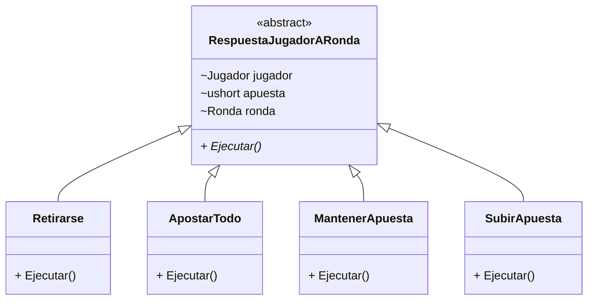
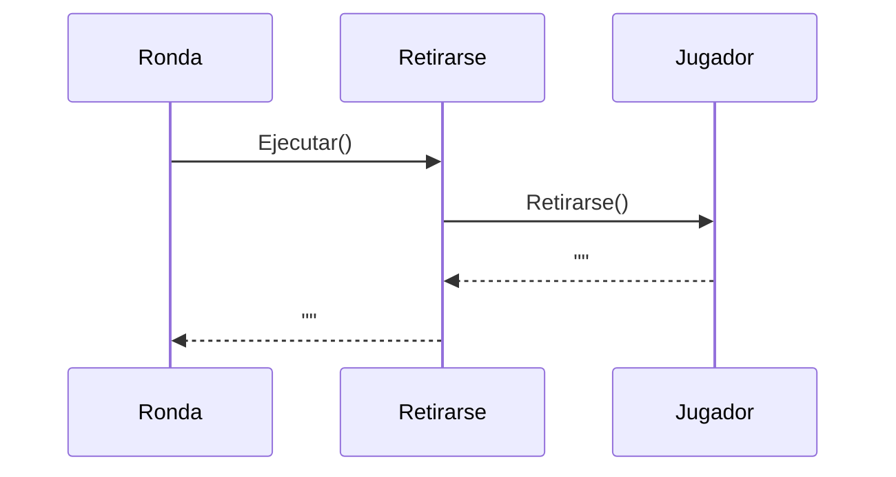

## Poker12.Core.LogicaRonda

### Diagrama de clases

```mermaid
classDiagram
    class RespuestaJugadorARonda{
        <<abstract>>
        ~Jugador jugador
        ~ushort apuesta
        ~Ronda ronda
        + Ejecutar()*
    }
    class Retirarse{
        + Ejecutar()
    }
    RespuestaJugadorARonda <|-- Retirarse

    class ApostarTodo{
        + Ejecutar()
    }

    class MantenerApuesta{
        + Ejecutar()
    }

    class SubirApuesta{
        + Ejecutar()
    }
    RespuestaJugadorARonda <|-- ApostarTodo
    RespuestaJugadorARonda <|-- MantenerApuesta
    RespuestaJugadorARonda <|-- SubirApuesta
```

#### Secuencia para Retirarse

```mermaid
sequenceDiagram
    participant Ronda
    participant Retirarse
    participant Jugador

    Ronda ->> Retirarse: Ejecutar()

    Retirarse ->> Jugador: Retirarse()
    Jugador -->> Retirarse: ""
    Retirarse -->> Ronda: ""

```