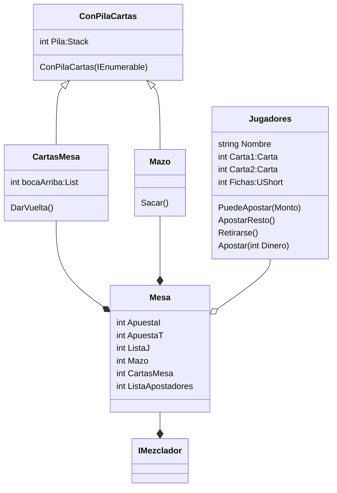

# Poker12

```mermaid
classDiagram

    ConPilaCartas <|-- CartasMesa
    ConPilaCartas <|-- Mazo
    CartasMesa --* Mesa
    Mazo --* Mesa
    Mesa --* IMezclador
    Jugadores --o Mesa
    Jugadores : PuedeApostar(Monto)
    Jugadores : ApostarResto()
    Jugadores : Retirarse()
    Jugadores : Apostar(int Dinero)
    ConPilaCartas : ConPilaCartas(IEnumerable<Carta>)
    CartasMesa : DarVuelta()
    Mazo : Sacar()


    class Jugadores{
        string Nombre
        int Carta1:Carta
        int Carta2:Carta
        int Fichas:UShort
    }

    class IMezclador{

    }

    class Mazo{

    }

    class CartasMesa{
        int bocaArriba:List<Carta>
    }

    class Mesa{
        int ApuestaI
        int ApuestaT
        int ListaJ<Jugadores>
        int Mazo
        int CartasMesa
        int ListaApostadores<Jugadores>
    }

    class ConPilaCartas{
        int Pila:Stack<Carta>
    }


```