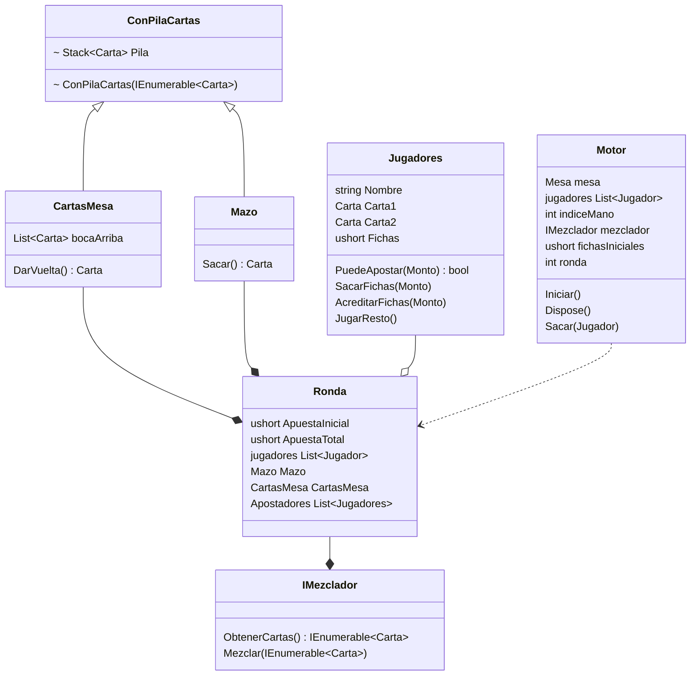

# Poker12

```mermaid
classDiagram

    ConPilaCartas <|-- CartasMesa
    ConPilaCartas <|-- Mazo
    CartasMesa --* Ronda
    Mazo --* Ronda
    Ronda --* IMezclador
    Jugadores --o Ronda
    Motor ..> Ronda


    class Jugadores{
        string Nombre
        Carta Carta1
        Carta Carta2
        ushort Fichas
        PuedeApostar(Monto) bool
        SacarFichas(Monto)
        AcreditarFichas(Monto)
        JugarResto()
    }

    class IMezclador{
        ObtenerCartas() IEnumerable~Carta~
        Mezclar (IEnumerable~Carta~)
    }

    class Mazo{
        Sacar() Carta
    }

    class CartasMesa{
        List~Carta~ bocaArriba
        DarVuelta() Carta
    }

    class Ronda{
        ushort ApuestaInicial
        ushort ApuestaTotal
        jugadores List~Jugador~
        Mazo Mazo
        CartasMesa CartasMesa
        Apostadores List~Jugadores~
    }

    class ConPilaCartas{
        ~ Stack~Carta~ Pila
        ~ ConPilaCartas(IEnumerable~Carta~)
    }

    class Motor{
        Mesa mesa
        jugadores List~Jugador~
        int indiceMano 
        IMezclador mezclador 
        ushort fichasIniciales
        int ronda
        Iniciar()
        Dispose()
        Sacar(Jugador)
    }

```
