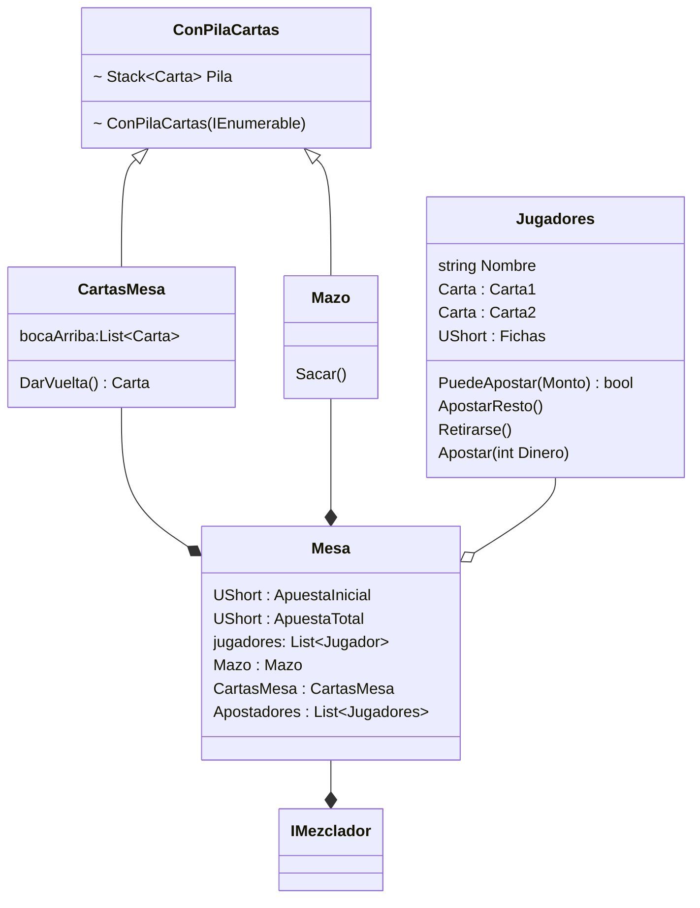

# Poker12

```mermaid
classDiagram

    ConPilaCartas <|-- CartasMesa
    ConPilaCartas <|-- Mazo
    CartasMesa --* Mesa
    Mazo --* Mesa
    Mesa --* IMezclador
    Jugadores --o Mesa
    Jugadores : PuedeApostar(Monto) bool
    Jugadores : ApostarResto()
    Jugadores : Retirarse()
    Jugadores : Apostar(int Dinero)
    ConPilaCartas : ~ ConPilaCartas(IEnumerable<Carta>)
    CartasMesa : DarVuelta() Carta
    Mazo : Sacar()


    class Jugadores{
        string Nombre
        Carta : Carta1
        Carta : Carta2
        UShort : Fichas
    }

    class IMezclador{

    }

    class Mazo{

    }

    class CartasMesa{
        bocaArriba:List~Carta~
    }

    class Mesa{
        UShort : ApuestaInicial
        UShort : ApuestaTotal
        jugadores: List~Jugador~
        Mazo : Mazo
        CartasMesa : CartasMesa
        Apostadores : List~Jugadores~
    }

    class ConPilaCartas{
        ~ Stack~Carta~ Pila
    }


```