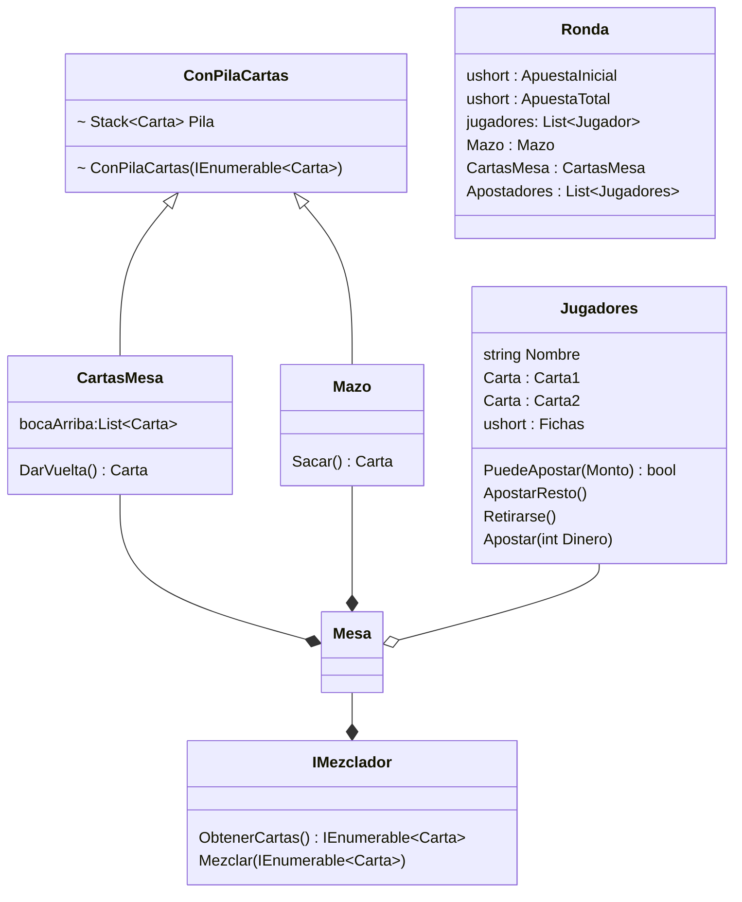

# Poker12

```mermaid
classDiagram

    ConPilaCartas <|-- CartasMesa
    ConPilaCartas <|-- Mazo
    CartasMesa --* Mesa
    Mazo --* Mesa
    Mesa --* IMezclador
    Jugadores --o Mesa


    class Jugadores{
        string Nombre
        Carta : Carta1
        Carta : Carta2
        ushort : Fichas
        PuedeApostar(Monto) bool
        ApostarResto()
        Retirarse()
        Apostar(int Dinero)
    }

    class IMezclador{
        ObtenerCartas() IEnumerable~Carta~
        Mezclar (IEnumerable~Carta~)
    }

    class Mazo{
        Sacar() Carta
    }

    class CartasMesa{
        bocaArriba:List~Carta~
        DarVuelta() Carta
    }

    class Ronda{
        ushort : ApuestaInicial
        ushort : ApuestaTotal
        jugadores: List~Jugador~
        Mazo : Mazo
        CartasMesa : CartasMesa
        Apostadores : List~Jugadores~
    }

    class ConPilaCartas{
        ~ Stack~Carta~ Pila
        ~ ConPilaCartas(IEnumerable~Carta~)
    }


```

Motor conoce una mesa,
ronda es mesa 