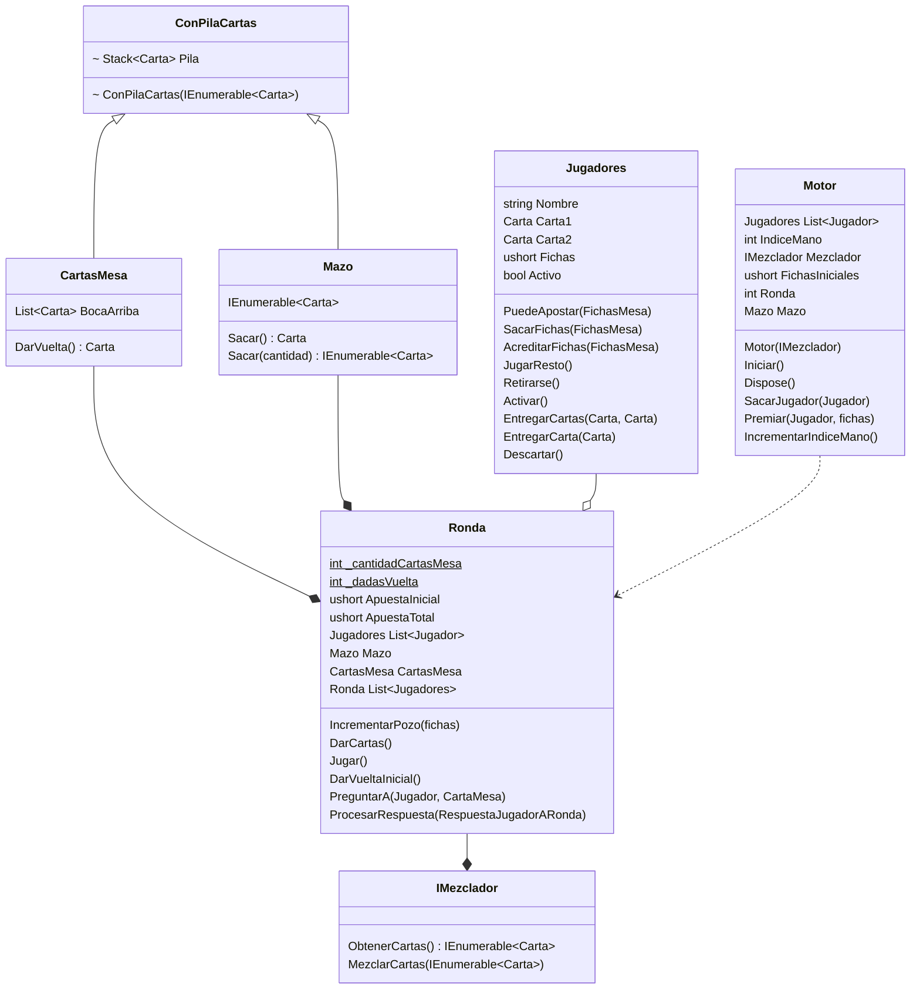

# Poker12

```mermaid
classDiagram

    ConPilaCartas <|-- CartasMesa
    ConPilaCartas <|-- Mazo
    CartasMesa --* Ronda
    Mazo --* Ronda
    Ronda --* IMezclador
    Jugadores --o Ronda
    Motor ..> Ronda


    class Jugadores{
        string Nombre
        Carta Carta1
        Carta Carta2
        ushort Fichas
        bool Activo
        PuedeApostar(FichasMesa) 
        SacarFichas(FichasMesa)
        AcreditarFichas(FichasMesa)
        JugarResto()
        Retirarse()
        Activar()
        EntregarCartas(Carta, Carta)
        EntregarCarta(Carta)
        Descartar()
    }

    class IMezclador{
        ObtenerCartas() IEnumerable~Carta~
        MezclarCartas (IEnumerable~Carta~)
    }

    class Mazo{
        IEnumerable~Carta~
        Sacar() Carta
        Sacar(cantidad) IEnumerable~Carta~
    }

    class CartasMesa{
        List~Carta~ BocaArriba
        DarVuelta() Carta
    }

    class Ronda{
        int _cantidadCartasMesa$
        int _dadasVuelta$
        ushort ApuestaInicial
        ushort ApuestaTotal
        Jugadores List~Jugador~
        Mazo Mazo
        CartasMesa CartasMesa
        Ronda List~Jugadores~
        IncrementarPozo(fichas)
        DarCartas()
        Jugar()
        DarVueltaInicial()
        PreguntarA(Jugador, CartaMesa)
        ProcesarRespuesta(RespuestaJugadorARonda)

    }

    class ConPilaCartas{
        ~ Stack~Carta~ Pila
        ~ ConPilaCartas(IEnumerable~Carta~)
    }

    class Motor{
        Jugadores List~Jugador~
        int IndiceMano
        IMezclador Mezclador 
        ushort FichasIniciales
        int Ronda
        Mazo Mazo
        Motor(IMezclador)
        Iniciar()
        Dispose()
        SacarJugador(Jugador)
        Premiar(Jugador, fichas)
        IncrementarIndiceMano()
    }

```
